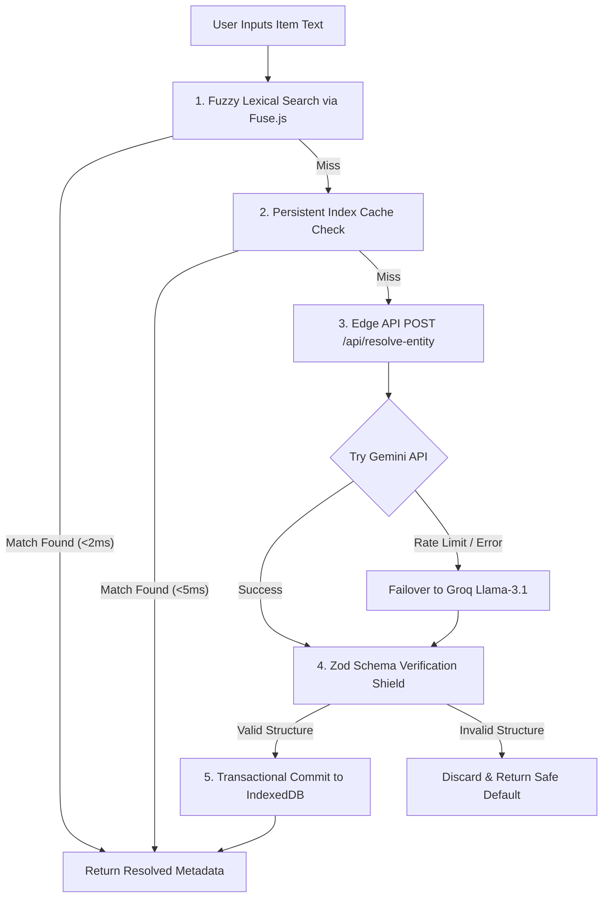
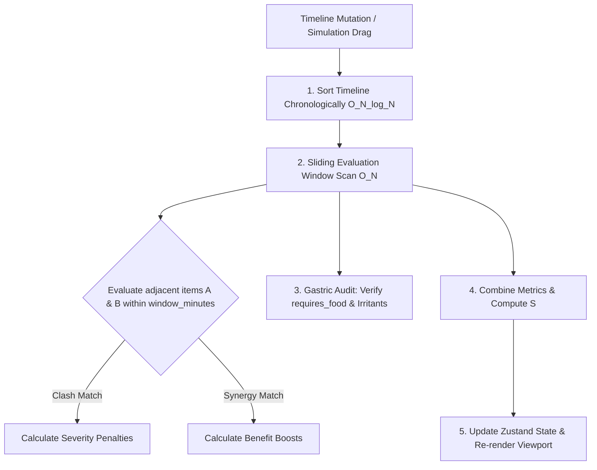

# BioVault — Clinical Interaction Engine

BioVault is a premium, enterprise-grade Clinical Interaction Engine designed for high-performance health tracking. It maps medications, supplements, and dietary items to evaluate safety, calculate drug-nutrient interactions, and suggest synergistic combinations—all with a strict **$0/month infrastructure cost** through a Local-First, Edge-Assisted architecture.

---

## ─── 1. Architectural Vision ───

BioVault is built as a **Local-First, Edge-Assisted Progressive Web App (PWA)**. The user's browser serves as the primary compute cluster and database engine (IndexedDB via Dexie.js), while serverless edge functions act as anonymous, free-tier fallbacks for AI-assisted entity resolution and diagnostic synthesis.

```
┌────────────────────────────────────────────────────────────────────────┐
│                          CLIENT BROWSER (EDGE)                         │
│                                                                        │
│  ┌───────────────────────┐   ┌─────────────────┐   ┌────────────────┐  │
│  │     Zustand Store     │◄──┤   PWA Caching   │   │  Fuse.js Fuzzy │  │
│  │ (Active/Shadow State) │   │ (sw.js Offline) │   │ Lexical Engine │  │
│  └───────────┬───────────┘   └────────┬────────┘   └───────┬────────┘  │
│              │                        │                    │           │
│              ▼                        ▼                    ▼           │
│  ┌──────────────────────────────────────────────────────────────────┐  │
│  │              Dexie.js Persistent Local Database                  │  │
│  │             (ai_resolved_cache & user_timeline)                  │  │
│  └─────────────────────────────────┬────────────────────────────────┘  │
└────────────────────────────────────┼───────────────────────────────────┘
                                     │ (Network Fallback)
                                     ▼
┌────────────────────────────────────────────────────────────────────────┐
│                        STATELESS CLOUD BOUNDARY                        │
│                                                                        │
│      ┌──────────────────────────────────────────────────────────┐      │
│      │               Vercel Edge Functions API                  │      │
│      │        (/api/resolve-entity & /api/analyze-symptoms)      │      │
│      └────────────────────────────┬─────────────────────────────┘      │
│                                   │                                    │
│                 ┌─────────────────┴─────────────────┐                  │
│                 ▼ (Failover O(1) Loop)              ▼ (Failover)       │
│      ┌─────────────────────┐             ┌─────────────────────┐       │
│      │   Gemini API Free   │────────────►│  Groq Llama-3 Free  │       │
│      └─────────────────────┘             └─────────────────────┘       │
└────────────────────────────────────────────────────────────────────────┘
```

### Key Behavioral Constraints
1. **$0 Infrastructure Cost**: Banned from using centralized, stateful servers.
2. **Data Integrity Shield**: No cloud-sourced AI payloads can enter IndexedDB without passing through a verified Zod schema check.
3. **Zero-Tracking Compliance**: Application analytics, device identifier logging, or telemetry scripts are strictly prohibited to ensure total anonymity.

---

## ─── 2. Core Pipelines & Operations ───

### Operation 1: Write-Through Entity Resolution Pipeline
When a user types an item string (e.g., *"Synthroid 50mcg"*):



### Operation 2: Temporal Window Matrix Scan & Scoring Engine
Every timeline mutation or drag-and-drop state simulation triggers an automated clinical re-evaluation pass executing inside an allocation buffer of **under 16ms** (sub-16ms layout rendering) to compute the wellness safety score ($S$):

$$S = 100 - (0.40 \cdot I_{\text{abs}} + 0.25 \cdot I_{\text{crit}} + 0.20 \cdot I_{\text{gastric}} + 0.15 \cdot I_{\text{cum}})$$

* $I_{\text{abs}}$: Absorption blockages and physical binding parameters.
* $I_{\text{crit}}$: Critical clinical contraindications and drug locks.
* $I_{\text{gastric}}$: Localized gastric irritation and lining parameters.
* $I_{\text{cum}}$: Long-term compound toxicity metrics.



### Operation 3: Reverse "Stomach-Ache Detective" Flow
When the user triggers the acute diagnostic tool:
1. Query the local IndexedDB `user_timeline` for entries where `scheduled_time` falls within the previous 180 minutes.
2. Execute a local Boolean Intersect Pass against immediate gastric irritant lists (e.g., *NSAIDs mixed with alcohol*). If matches are identified, skip cloud requests and instantly display the diagnostic layout.
3. If local pattern arrays display zero warnings, drop user telemetry indexes, isolate only raw compound text strings, and invoke the edge endpoint `/api/analyze-symptoms` for clinical synthesis.

### Operation 4: In-Browser "What-If" Workspace Simulator Loop
1. **State Cloner**: Intercept element drag events and clone the active Zustand timeline slice into an uncommitted "Shadow" memory array.
2. **Shadow Scanning**: Feed the shadow array to the scan engine to evaluate wellness score differentials in real-time.
3. **Micro-Delta Notifications**: Update layout labels adjacent to the cursor (e.g., *"+12 Optimal Absorption Boost"* or *"-20 Conflict Warning"*) without changing the persistent database.
4. **Commit vs. Eviction**: Committing (dropping) saves the shadow state to the IndexedDB table; aborting clears the shadow array memory, preventing DOM lag.

---

## ─── 3. Database Schema & Static Context ───

### Static Context Databases (`src/context/`)
The local clinical knowledge base is split into static JSON chunks:
* `core_meds.json` (470 entries): Static medication profiles including dosage formulations, classes, half-lives, and absorption notes.
* `supplements.json` (405 entries): Static supplement metadata containing category, slot, food requirements, and aliases.
* `foods.json` (433 entries): Dietary interaction profiling covering food groups and impact profiles.
* `clash_rules.json` (160 rules): Clinical interaction matrix nested by compound keys.
* `boost_rules.json` (71 rules): Synergistic pairings and score bonuses.

### Client-Side IndexedDB persistent database (`src/db/schema.ts`)
```typescript
export interface AIResolvedCacheEntry {
  user_input_string: string;    // Primary Key (e.g., "synthroid 50mcg")
  generic_name: string;         // Indexed reference
  category: 'medicine' | 'supplement' | 'food';
  optimal_slot: 'FASTING' | 'WITH_MEAL' | 'AFTER_MEAL' | 'BEFORE_BED';
  requires_food: boolean;
  confidence_level: 'HIGH' | 'MEDIUM' | 'THEORETICAL';
  evidence_sources: Array<{ title: string; url?: string; summary: string }>;
  last_updated: number;         // Unix timestamp
}

export interface UserTimelineEntry {
  id?: number;                  // Auto-increment primary key
  profile_id: string;           // Isolation partition key
  scheduled_time: string;       // HH:MM format
  item_name: string;            // Raw user input
  generic_resolved: string;     // Key link to static databases/cache
  vehicle: 'water' | 'milk' | 'coffee' | 'juice' | 'alcohol';
}

export interface UserProfile {
  id: string;                   // UUID
  name: string;
  avatar_color: string;         // Hex color
  created_at: number;
}
```

---

## ─── 4. Local Startup & Setup ───

### Prerequisites
* Node.js (v18 or higher)
* npm or yarn

### Installation & Run

1. **Install Dependencies**:
   ```bash
   npm install
   ```

2. **Configure Environment Variables**:
   Create a `.env.local` file in the root directory:
   ```env
   GEMINI_API_KEY=your_gemini_api_key_here
   GROK_API_KEY=your_grok_api_key_here
   ```

3. **Run Development Mode**:
   ```bash
   npm run dev
   ```
   Open **[http://localhost:3000](http://localhost:3000)** in your browser.

4. **Verify TypeScript & Build**:
   ```bash
   npm run type-check   # Runs tsc --noEmit
   npm run build        # Compiles production bundle
   ```

---

## ─── 5. Production Free-Tier Deployment ───

### Deploying to Vercel
1. Push your code to your GitHub repository:
   ```bash
   git add .
   git commit -m "deploy: initial commit"
   git push -u origin main
   ```
2. Log into [Vercel](https://vercel.com) using your GitHub account.
3. Import your **BioVault** repository.
4. Add the environment variables (`GEMINI_API_KEY`, `GROK_API_KEY`) under project configurations.
5. Click **Deploy**. Vercel will build and serve the application globally on a free `*.vercel.app` domain.
